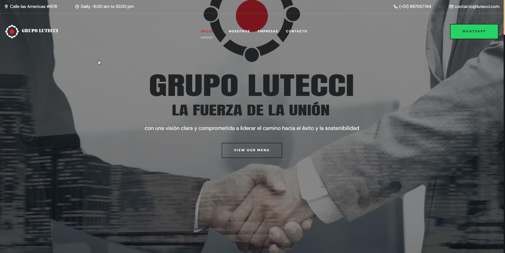

  
  
  
  

   
   

  <h2 align="center">Grupo lutecci - Pagina web</h2>

  Grupo lutecci es una pagina  web responsive,  Responsive para todos los dispositivos, construido usando HTML, CSS y JavaScript.

  <a href="https://grupo-lutecci.vercel.app"><strong>➥ Live Demo</strong></a>

 

### Demo Screeshots

### Contact

Si quieres contactar conmigo puedes contactarme en [Facebook](https://www.facebook.com/henri76300424?locale=es_LA).

### License

[MIT](https://choosealicense.com/licenses/mit/)
